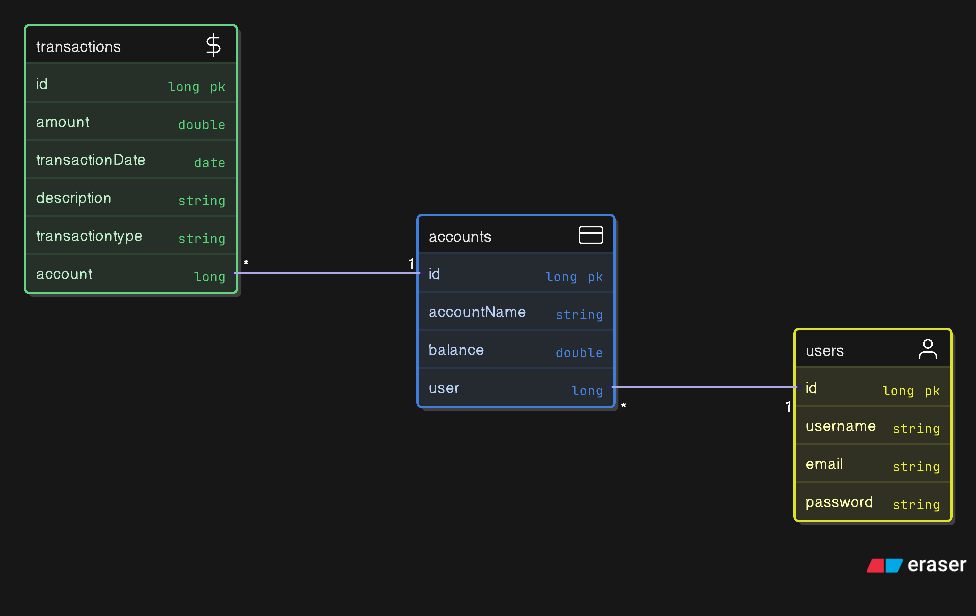
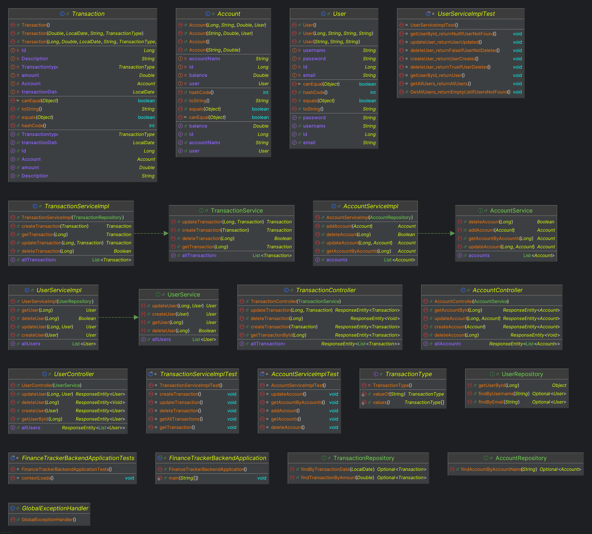
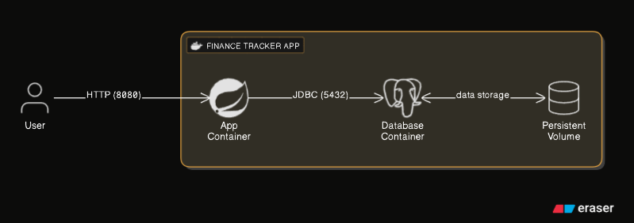

# ahtat204/finance-tracker: Personal Finance Tracker 💸 


The **Finance Tracker** is a full-stack application designed to help users manage their personal finances, track transactions, and monitor accounts. It is built using a **microservices architecture** with a distinct **Spring Boot backend** and a **JavaFX frontend**, all managed by **Maven**.

## 💻 Tech Stack

| Component | Technology | Description |
| :--- | :--- | :--- |
| **Backend** | **Java 17, Spring Boot 3.x** | Provides the REST API, business logic, and persistence layer. |
| **Frontend** | **Java 17, JavaFX** | A desktop application providing the user interface. |
| **Database** | **PostgreSQL** | Relational database for storing user, account, and transaction data. |
| **Cache** | **Redis** | Key-Value NoSQL database for ultra-fast data access. |
| **Build Tool** | **Maven** | Manages dependencies and the multi-module project structure. |
| **Containerization** | **Docker** & **Docker Compose** | Used for easy setup and deployment of the backend and database. |

## 📁 Project Structure

This is a multi-module Maven project, organized into two main parts:

```
ahtat204-finance-tracker/
├── pom.xml                   # Root Maven file defining sub-modules
├── FinanceTrackerBackend/    # The Spring Boot REST API module
│   ├── src/main/java/...     # Backend Java source code (Controllers, Services, Entities)
│   ├── docker-compose.yml    # Docker setup for the backend and Postgres DB
│   └── pom.xml               # Backend specific dependencies (JPA, Web, Postgres, Lombok)
└── FinanceTrackerFrontEnd/   # The JavaFX Desktop UI module
    ├── src/main/java/...     # Frontend JavaFX source code (UI Controllers)
    └── pom.xml               # Frontend specific dependencies (JavaFX modules)
```

## ⚙️ Backend Architecture (`FinanceTrackerBackend`)

The backend is a standard **Spring Boot** application responsible for data persistence and API exposure.

| Layer | Classes | Responsibilities |
| :--- | :--- | :--- |
| **Controllers** | `UserController`, `AccountController`, `TransactionController` | Exposes **RESTful API endpoints** for all operations (CRUD). |
| **Services** | `UserServiceImpl`, `AccountServiceImpl`, `TransactionServiceImpl` | Implements the **business logic**, transactional management, and data validation. |
| **Entities** | `User`, `Account`, `Transaction` | **JPA entities** representing the database schema. |
| **Repositories** | `UserRepository`, `AccountRepository`, `TransactionRepository` | **Spring Data JPA** interfaces for database access. |

### API Endpoints (Partial Example)

The API is exposed under the `/api/` path (e.g., `http://localhost:8080/api/accounts`).

| Resource | HTTP Method | Endpoint | Description |
| :--- | :--- | :--- | :--- |
| **Accounts** | `GET` | `/api/accounts/{id}` | Retrieve a specific account. |
| **Accounts** | `POST` | `/api/accounts` | Create a new account. |
| **Transactions** | `GET` | `/api/transactions` | Retrieve all transactions. |
| **Users** | `GET` | `/api/users` | Retrieve all users. |

## 🚀 Setup and Running Locally

The easiest way to get the **backend** and **database** running is by using Docker Compose.

### 1\. Build the Backend Application

Navigate to the project root and use Maven to clean and package the application.

```bash
# In the repository root:
./mvnw clean package
```

This will generate the necessary JAR file for the Docker image within `FinanceTrackerBackend/target/`.

### 2\. Configure Environment

Create a file named `.env` in the `FinanceTrackerBackend/` directory with your desired database credentials and connection string:

```
# Example .env file in FinanceTrackerBackend/
DB_USERNAME=finuser
DB_PASSWORD=secret
database=finance_tracker_db
DB_URL=jdbc:postgresql://db:5432/${database}
```

### 3\. Run with Docker Compose

With the `.env` file and the built JAR, you can start the entire backend stack (PostgreSQL DB and Spring Boot API).

```bash
# Navigate to the backend directory:
cd FinanceTrackerBackend/

# Start the services
docker-compose up --build -d
```

* The **PostgreSQL database** will be accessible on `localhost:5432`.
* The **Spring Boot API** will be accessible on `http://localhost:8080`.

### 4\. Running the Frontend

The `FinanceTrackerFrontEnd` is a standard JavaFX application. It can be run after the backend is up and running:

1.  Open the project in your IDE (e.g., IntelliJ IDEA or VS Code).
2.  Run the `org.asue24.financetrackerfrontend.HelloApplication` class.

## 🧪 Testing

The backend includes **unit tests** for its core business logic within the service layer.

```
FinanceTrackerBackend/src/test/java/.../services/
├── account/AccountServiceImplTest.java
├── transaction/TransactionServiceImplTest.java
└── user/UserServiceImplTest.java
```

To run all tests:

```bash
./mvnw test
```


## Database Diagram:



## Backend Project Diagram:



## Docker Containers:



## to test the  API , Install Docker ,if you don't have it already, create a file with "docker-compose.yml" , copy-paste the content below: 

```yaml
version: '3.9'

services:
  # --- API Service Configuration ---
  api:
    image: lahcen3ahtat/finance-tracker:1.1  # The API's Docker image
    container_name: app
    ports:
      - "8080:8080" # Map host port 8080 to container port 8080
    environment:
      # These environment variables
      SPRING_DATASOURCE_URL: ${DB_URL} 
      SPRING_DATASOURCE_USERNAME: ${DB_USERNAME}
      SPRING_DATASOURCE_PASSWORD: ${DB_PASSWORD}
      SPRING_JPA_HIBERNATE_DDL_AUTO: update
    depends_on:
      - db # Ensure PostgresSQL starts before the API
    networks:
      - app-network

  # ---PostgresSQL database service configuration
  db:
     image: postgres:13.1-alpine
     container_name: db
     environment:
      POSTGRES_USER: ${DB_USERNAME}
      POSTGRES_PASSWORD: ${DB_PASSWORD}
      POSTGRES_DB: ${database}
     ports:
      - "5432:5432"
     volumes:
      - postgres_data:/var/lib/postgresql/data
# --- Docker Volume for Data Persistence ---
volumes:
  mongo-data:

# --- Docker Network for Service Communication ---
networks:
  app-network:
```

## After the image was successfully built , simply run "docker-compose up -d"  and , the API should be running on port 8080
